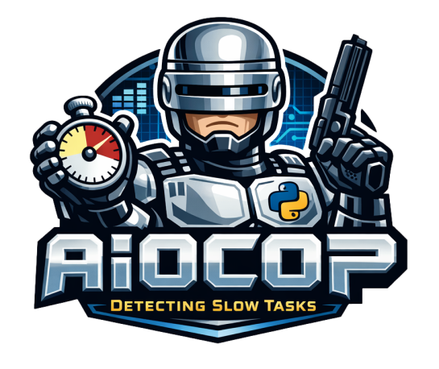

<p align="center">
  
</p>


[](https://aiocop.readthedocs.io/en/latest/?version=latest)

Non-intrusive monitoring for Python asyncio. Detects, pinpoints, and logs blocking IO and CPU calls that freeze your event loop.

* PyPI package: https://pypi.org/project/aiocop/
* Free software: MIT License
* Documentation: https://aiocop.readthedocs.io.

## Features

* **Blocking I/O Detection**: Automatically detects blocking I/O calls (file operations, network calls, subprocess, etc.) in your async code
* **Stack Trace Capture**: Captures full stack traces to pinpoint exactly where blocking calls originate
* **Severity Scoring**: Assigns severity scores to blocking events to help prioritize fixes
* **Callback-based Events**: Register callbacks to handle slow task events however you need (logging, metrics, alerts)
* **Dynamic Controls**: Enable/disable monitoring at runtime, useful for gradual rollout or debugging sessions
* **Exception Raising**: Optionally raise exceptions on high-severity blocking I/O for strict enforcement during development

## Installation

```bash
pip install aiocop
```

## Quick Start

```python
import aiocop

# Define a callback to handle slow task events
def on_slow_task(event: aiocop.SlowTaskEvent) -> None:
    if event.exceeded_threshold:
        print(f"SLOW TASK DETECTED!")
        print(f"  Elapsed: {event.elapsed_ms:.2f}ms (threshold: {event.threshold_ms}ms)")
        print(f"  Severity: {event.severity_level} (score: {event.severity_score})")
        print(f"  Reason: {event.reason}")
        for evt in event.blocking_events:
            print(f"    - {evt['event']}")
            print(f"      at {evt['trace']}")

# 1. Patch stdlib functions to emit audit events
aiocop.patch_audit_functions()

# 2. Register the audit hook to capture blocking IO
aiocop.start_blocking_io_detection(trace_depth=20)

# 3. Patch the event loop to detect slow tasks
aiocop.detect_slow_tasks(
    threshold_ms=30,
    on_slow_task=on_slow_task,
)

# 4. Activate monitoring when your app is ready
aiocop.activate()
```

## Usage with ASGI (FastAPI, Starlette, etc.)

```python
# In your ASGI application setup (e.g., main.py or asgi.py)
import aiocop

def setup_monitoring() -> None:
    aiocop.patch_audit_functions()
    aiocop.start_blocking_io_detection(trace_depth=20)
    aiocop.detect_slow_tasks(threshold_ms=30, on_slow_task=log_to_monitoring)

def log_to_monitoring(event: aiocop.SlowTaskEvent) -> None:
    # Send to your monitoring system (Datadog, Prometheus, etc.)
    if event.exceeded_threshold:
        metrics.increment("async.slow_task", tags={
            "severity": event.severity_level,
            "reason": event.reason,
        })
        metrics.gauge("async.slow_task.elapsed_ms", event.elapsed_ms)

# Call setup early in your application lifecycle
setup_monitoring()

# Activate after startup (e.g., in a lifespan handler)
@asynccontextmanager
async def lifespan(app):
    aiocop.activate()  # Start monitoring after startup
    yield
    aiocop.deactivate()
```

## Dynamic Controls

### Enable/Disable Monitoring at Runtime

```python
# Pause monitoring
aiocop.deactivate()

# Resume monitoring
aiocop.activate()

# Check if monitoring is active
if aiocop.is_monitoring_active():
    print("Monitoring is running")
```

### Raise Exceptions on High Severity Blocking I/O

Useful during development to catch blocking calls immediately:

```python
# Enable globally for current context
aiocop.enable_raise_on_violations()

# Disable
aiocop.disable_raise_on_violations()

# Or use as a context manager
with aiocop.raise_on_violations():
    await some_operation()  # Will raise HighSeverityBlockingIoException if blocking
```

## Context Providers

Context providers allow you to capture external context (like tracing spans, request IDs, etc.) that will be passed to your callbacks. The context is captured **within the asyncio task's context**, ensuring proper propagation of contextvars.

### Basic Usage

```python
from typing import Any

def my_context_provider() -> dict[str, Any]:
    return {
        "request_id": get_current_request_id(),
        "user_id": get_current_user_id(),
    }

aiocop.register_context_provider(my_context_provider)

def on_slow_task(event: aiocop.SlowTaskEvent) -> None:
    request_id = event.context.get("request_id")
    print(f"Slow task in request {request_id}: {event.elapsed_ms}ms")
```

### Integration with Datadog

```python
from ddtrace import tracer
from typing import Any

def datadog_context_provider() -> dict[str, Any]:
    return {"datadog_span": tracer.current_span()}

aiocop.register_context_provider(datadog_context_provider)

def log_to_datadog(event: aiocop.SlowTaskEvent) -> None:
    if event.exceeded_threshold is False:
        return

    span = event.context.get("datadog_span")
    if span is None:
        return

    span.set_tag("slow_task.detected", True)
    span.set_metric("slow_task.elapsed_ms", event.elapsed_ms)
    span.set_metric("slow_task.severity_score", event.severity_score)
    span.set_tag("slow_task.severity_level", event.severity_level)
    span.set_tag("slow_task.reason", event.reason)

aiocop.detect_slow_tasks(threshold_ms=30, on_slow_task=log_to_datadog)
```

### Why Context Providers?

When aiocop detects a slow task, the callback is invoked **after** the task completes. By that time, the original context (like the active tracing span) might no longer be accessible via standard context lookups.

Context providers solve this by capturing the context **at the start of each task execution**, within the task's own contextvars context. This ensures that:

1. Tracing spans are captured before they're closed
2. Request-scoped data is available to callbacks
3. Any contextvar-based state is properly preserved

### Managing Context Providers

```python
# Register a provider
aiocop.register_context_provider(my_provider)

# Unregister a specific provider
aiocop.unregister_context_provider(my_provider)

# Clear all providers
aiocop.clear_context_providers()
```

Context providers are **completely optional**. If none are registered, `event.context` will simply be an empty dict.

## Event Types

### SlowTaskEvent

Emitted when either:
- **Blocking I/O is detected** (`reason="io_blocking"`) - regardless of whether the task exceeded the threshold
- **Task exceeds threshold but no blocking I/O detected** (`reason="cpu_blocking"`) - indicates CPU-bound blocking

```python
@dataclass(frozen=True)
class SlowTaskEvent:
    elapsed_ms: float        # How long the task took
    threshold_ms: float      # Configured threshold
    exceeded_threshold: bool # True if elapsed > threshold
    severity_score: int      # Aggregate severity (sum of event weights), 0 for cpu_blocking
    severity_level: str      # "low", "medium", or "high"
    reason: str              # "io_blocking" or "cpu_blocking"
    blocking_events: list[BlockingEventInfo]  # List of detected events (empty for cpu_blocking)
    context: dict[str, Any]  # Custom context from context providers (default: {})
```

### BlockingEventInfo

Information about each blocking event:

```python
class BlockingEventInfo(TypedDict):
    event: str        # e.g., "open(/path/to/file)"
    trace: str        # Stack trace
    entry_point: str  # First frame in the trace
    severity: int     # Weight of this event
```

## Severity Weights

Events are classified by severity:

| Weight | Value | Examples |
|--------|-------|----------|
| `WEIGHT_HEAVY` | 50 | `socket.connect`, `subprocess.Popen`, `time.sleep`, DNS lookups |
| `WEIGHT_MODERATE` | 10 | `open()`, file mutations, `os.listdir` |
| `WEIGHT_LIGHT` | 1 | `os.stat`, `fcntl.flock`, `os.kill` |
| `WEIGHT_TRIVIAL` | 0 | `os.getcwd`, `os.path.abspath` |

Severity levels are determined by aggregate score:
- **high**: score >= 50
- **medium**: score >= 10
- **low**: score < 10

## API Reference

### Setup Functions

- `patch_audit_functions()` - Patches stdlib functions to emit audit events
- `start_blocking_io_detection(trace_depth=20)` - Registers the audit hook
- `detect_slow_tasks(threshold_ms=30, on_slow_task=None)` - Patches the event loop
- `activate()` / `deactivate()` - Control monitoring at runtime

### Callback Management

- `register_slow_task_callback(callback)` - Add a callback
- `unregister_slow_task_callback(callback)` - Remove a callback
- `clear_slow_task_callbacks()` - Remove all callbacks

### Context Provider Management

- `register_context_provider(provider)` - Add a context provider
- `unregister_context_provider(provider)` - Remove a context provider
- `clear_context_providers()` - Remove all context providers

### Raise-on-Violations Controls

- `enable_raise_on_violations()` - Enable for current context
- `disable_raise_on_violations()` - Disable for current context
- `is_raise_on_violations_enabled()` - Check current state
- `raise_on_violations()` - Context manager

### Utility Functions

- `calculate_io_severity_score(events)` - Calculate severity from events
- `get_severity_level_from_score(score)` - Get "low"/"medium"/"high"
- `format_blocking_event(raw_event)` - Format a raw event
- `get_blocking_events_dict()` - Get all monitored events with weights
- `get_patched_functions()` - Get list of patched functions
